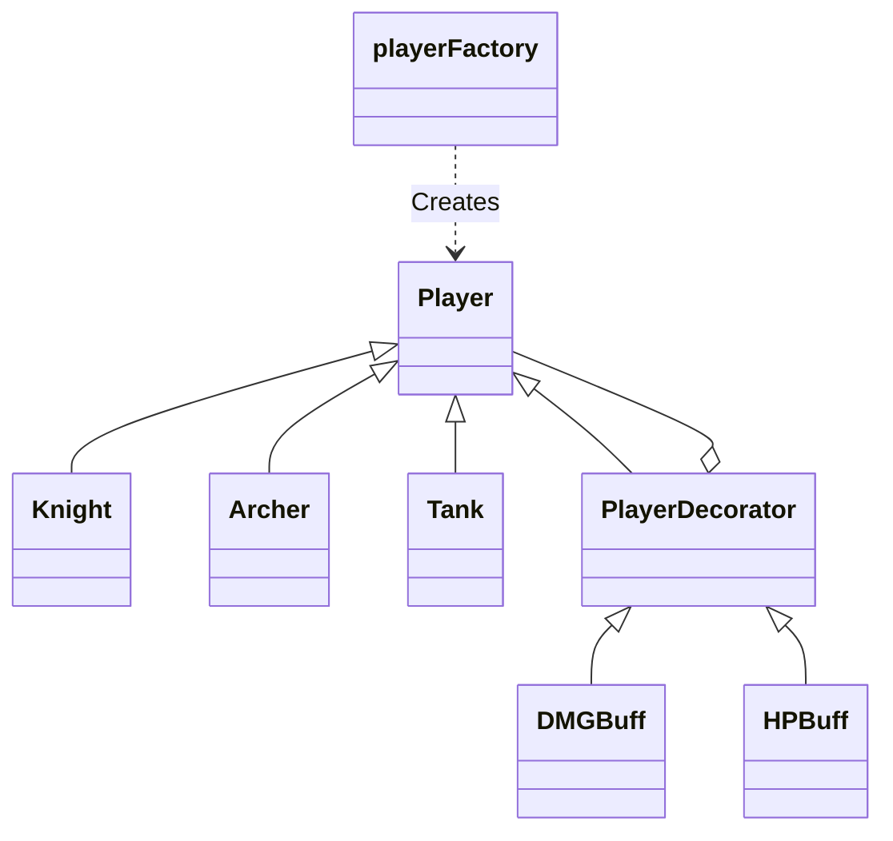

# Terminal RPG: Design Patterns Implementation

A professional Java-based terminal RPG that demonstrates the practical use of **Creational, Structural, and Behavioral design patterns**.

## 🛡️ Core Features
- **Endless Survival Mode:** Enemies scale in HP and Damage as you progress through stages.
- **Unique Class Abilities:** Knight, Archer, and Tank each have specific strategies for combat and healing.
- **Dynamic Buff System:** Use of decorators to add equipment or cheats at runtime.
- **Retro UI:** Enhanced with ANSI colors and ASCII art for an immersive experience.

## 🏗️ Architectural Design Patterns

### 1. Factory Method (Creational)
The character creation logic is encapsulated in `playerFactory.java`. This decouples the `Main` class from the specific subclasses, adhering to the **Open/Closed Principle**.

### 2. Decorator (Structural)
The `PlayerDecorator` system allows for dynamic stat modifications. Buffs like `DMGBuff`, `HPBuff`, and the secret `CheatBuff` wrap the player object, favoring **Composition over Inheritance**.

### 3. Strategy / Polymorphism (Behavioral)
Combat behavior is decentralized. Each class implements its own `attack()`, `heal()`, and `specialAbility()` logic. The game engine follows the **"Tell, Don't Ask"** principle by commanding the player object without checking its specific type.

## 📊 Class Diagram (Mermaid)

## 🚀 How to Run
1. Navigate to the src directory.
2. Compile the source code:
```
javac *.java
```
3.Launch the game:
```
java Main
```
⌨️ Cheat Codes

Enter HESOYAM as your nickname to activate God Mode via the CheatBuff decorator.